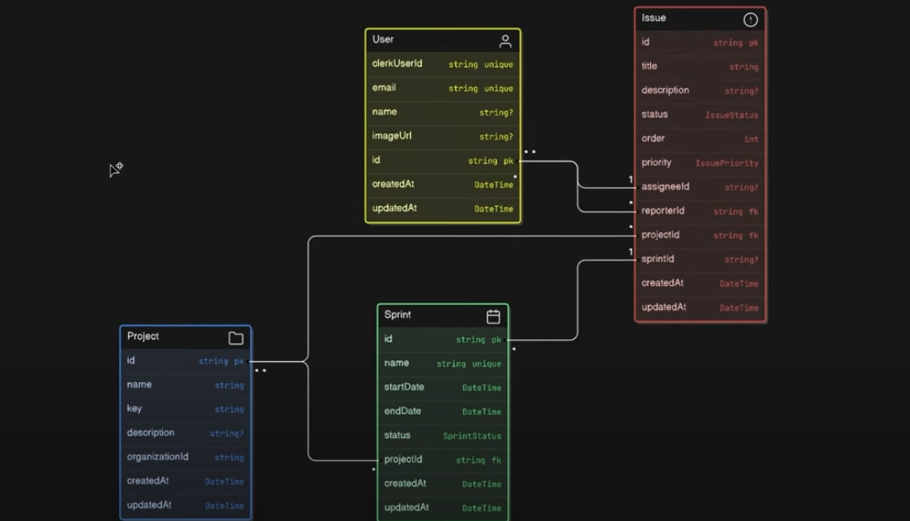
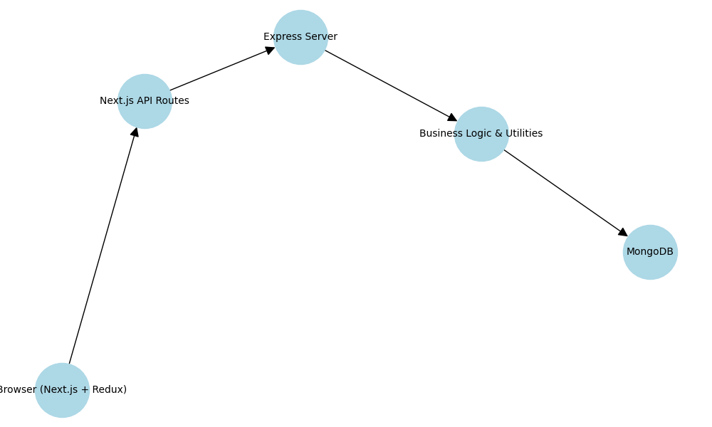
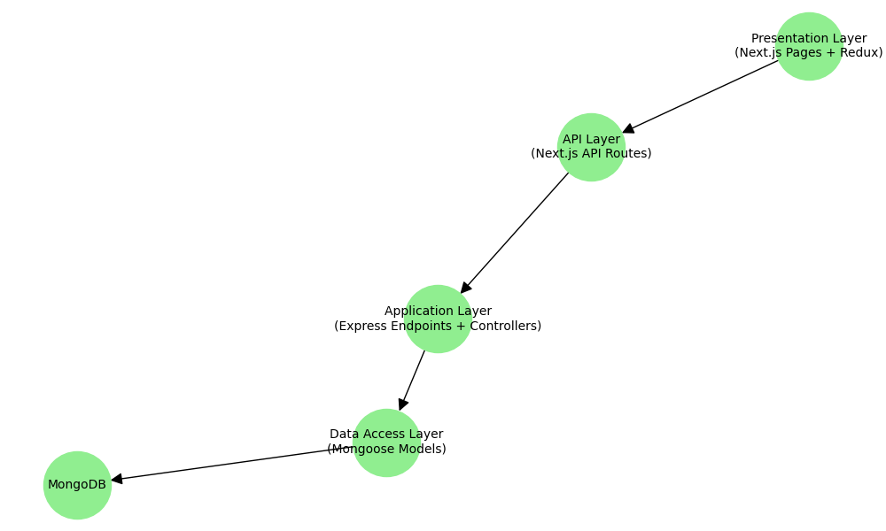
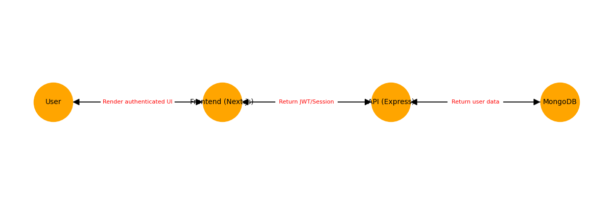
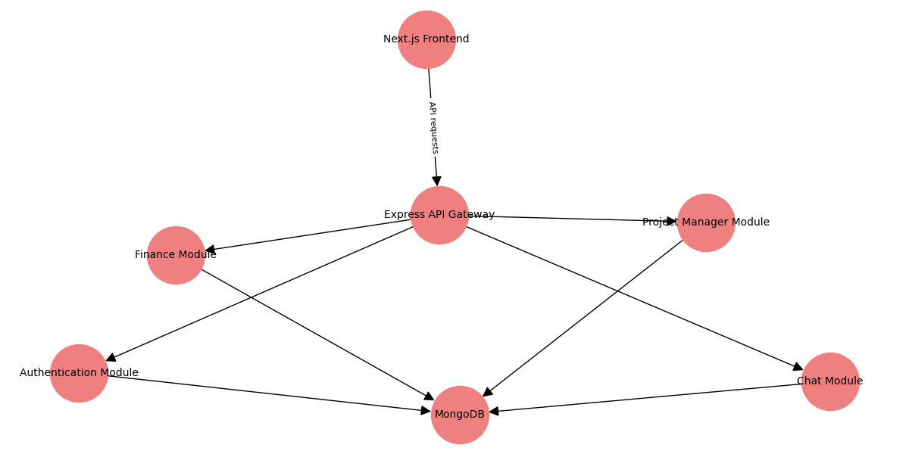
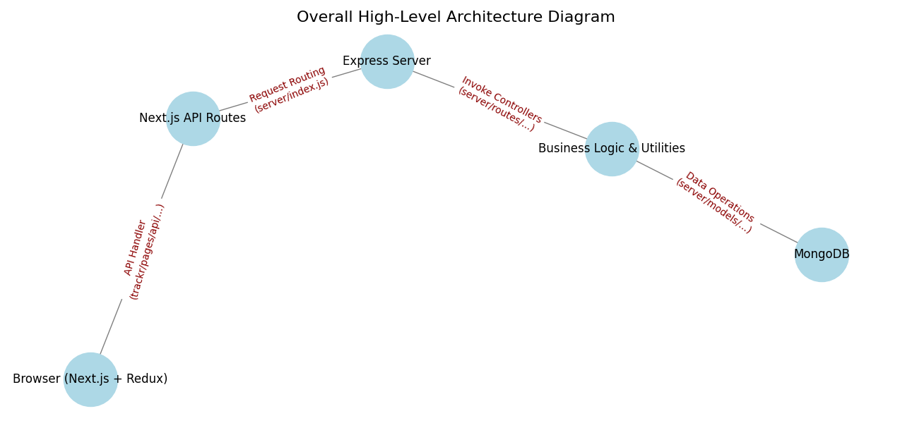
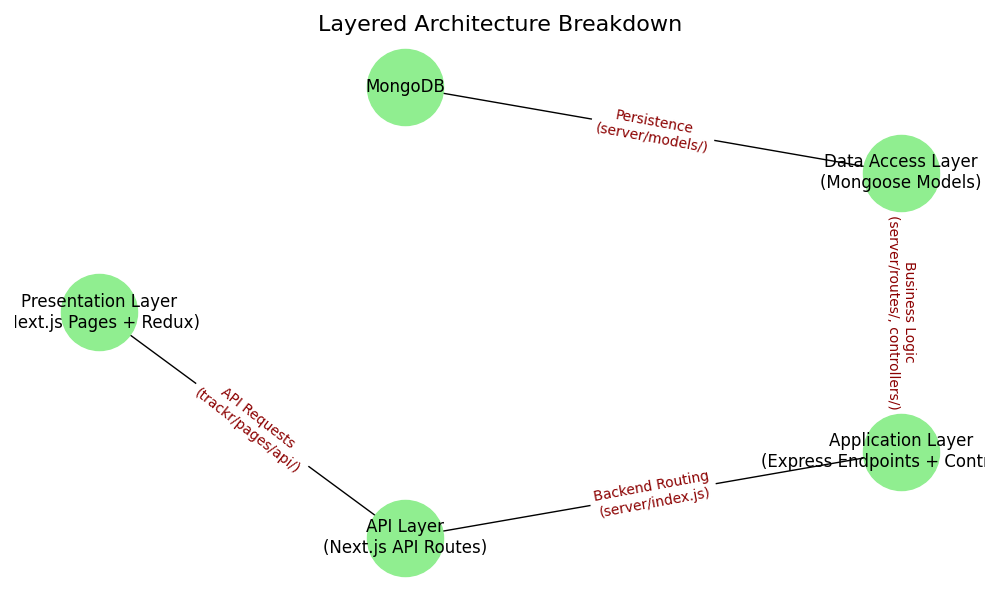
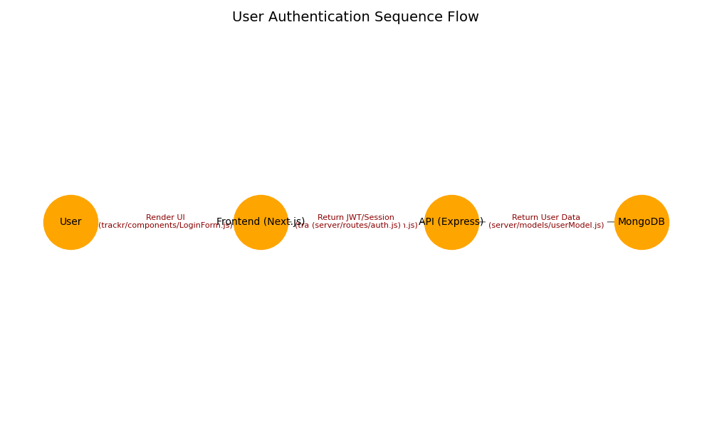
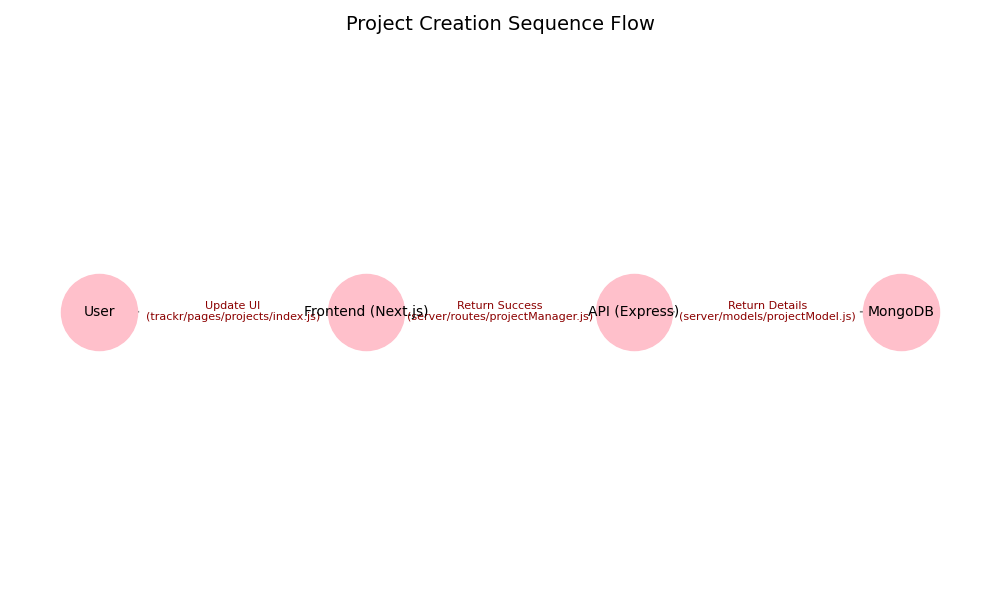
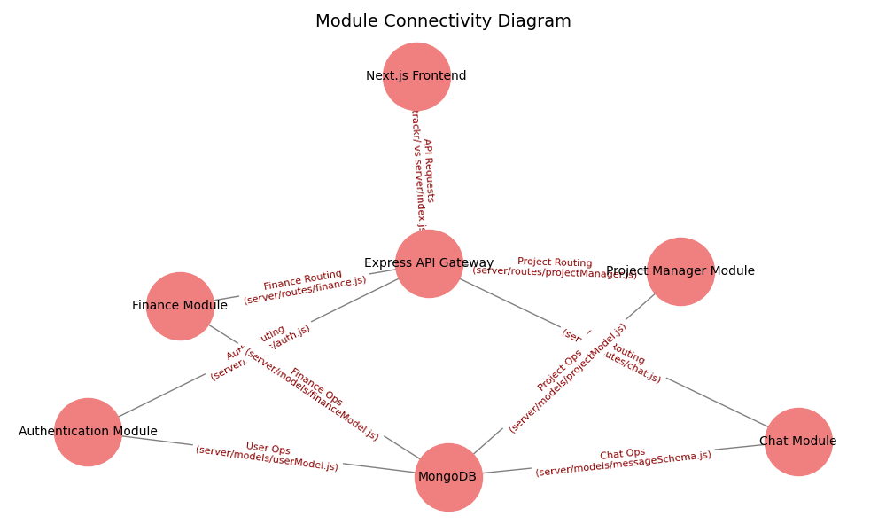

### Trackr- Project Manager

(Inspired by Jira)


<div>
  
  
  
  
  
</div>

<h3 align="center">Trackr – Project Manager</h3>

## 📋 Table of Contents

1. [Introduction](#introduction)
2. [Tech Stack](#tech-stack)
3. [Features](#features)
4. [Quick Start](#quick-start)
5. [Database](#Database)
6. [System Design](#System Design )
7. [File Working](# File Working )

## 🤖 Introduction

**Trackr – Project Manager** is a robust, full-stack project management application designed to help teams efficiently organize and track their work. With an intuitive user interface and powerful backend support, Trackr offers tools for creating projects, assigning tasks, monitoring progress, and streamlining team collaboration—all in one central platform.

Whether you’re managing a small team or coordinating large-scale projects, Trackr provides real-time updates, detailed dashboards, and secure user authentication to keep everyone on track.

## ⚙️ Tech Stack

- **Frontend:** React, TailwindCSS
- **Backend:** Node.js, Express
- **Database:** MongoDB
- **Other Tools:** JWT for Authentication, Socket.io for Real-Time Updates (optional)

## 🔋 Features

- **User Authentication:** Secure registration, login, and role-based access control.
- **Project & Task Management:** Create, update, and delete projects and tasks with deadlines and priority settings.
- **Team Collaboration:** Assign tasks to team members and track progress with real-time notifications.
- **Dashboard & Analytics:** Visual dashboards to monitor project status, upcoming deadlines, and team performance.
- **Responsive Design:** Fully responsive UI for seamless use on desktops, tablets, and mobile devices.

## 🤸 Quick Start

Follow these steps to set up the project locally on your machine.

### Prerequisites

Ensure you have the following installed on your machine:

- [Git](https://git-scm.com/)
- [Node.js](https://nodejs.org/en/) (v14+ recommended)
- [npm](https://www.npmjs.com/) or [Yarn](https://yarnpkg.com/)

### Cloning the Repository

Clone the repository and navigate to the project directory:

```bash
git clone https://github.com/Ayush110103/Trackr-Project_Manager.git
cd Trackr-Project_Manager
```

Installation
Install the project dependencies:

```bash
Copy
npm install
# or, if you use Yarn:
# yarn install
```

Running the Project
Start the development server:

```bash
npm run dev
# or, with Yarn:
# yarn dev
```

### Database Schema



### System Design 









### File Working


